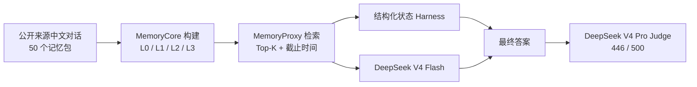

# TencentDB Agent Memory：智能座舱长记忆 Recovery33

这是一个可审计的研究快照，包含智能座舱长记忆系统的最终代码、公开来源评测集、Recovery33 构建记忆以及 500 题端到端评测结果。

> 发布日期：2026-09-02（Asia/Shanghai）  
> 状态：冻结快照；评测结束后未继续写入 Recovery33 记忆  
> 使用限制：完整 500 题数据和派生记忆仅限研究/非商业用途，详见[数据许可](#数据许可与隐私)

## 最终结果

| 指标 | 结果 |
| --- | ---: |
| 全量准确率 | **89.2%（446/500）** |
| 时间推理 | **100%（100/100）** |
| 单会话偏好 | **92%（46/50）** |
| 知识更新 | **89%（178/200）** |
| 多会话记忆 | **81.3%（122/150）** |
| 空回答 / Judge 调用错误 | **0 / 0** |
| 相对既有 78% 基线 | **+11.2 个百分点** |

142 道高置信问题由带来源约束的结构化 Harness 直接回答并全部通过 Judge；其余 358 道调用 DeepSeek V4 Flash，304 道通过。独立评审使用 DeepSeek V4 Pro。

## 仓库内容

| 内容 | 路径 | 说明 |
| --- | --- | --- |
| 最终 MemoryCore / MemoryProxy 源码 | `third_party/tencentdb-agent-memory-v2/` | 当前 Recovery33 使用的工作树快照，不含依赖缓存和密钥 |
| 评测与结构化状态代码 | `benchmarks/framework_eval/` | 时间账本、证据召回、回答 Harness、数据校验及测试 |
| 500 题数据集 | `benchmarks/framework_eval/challenges/cockpit_zh_public_mix_500_v7/` | 50 个新记忆包、500 道题、10 种能力、5 种 ASR 文本风格 |
| 全量结果 | `artifacts/results/recovery33-full500/` | 检索证据、逐题回答、逐题 Judge、日志和汇总 |
| 已构建记忆 | `artifacts/memory/recovery33-memory.tar.gz` | Recovery33 的 L0/L1/L2/L3、向量库、元数据与 checkpoint，只含基准数据 |
| 来源与版本 | `docs/RELEASE_PROVENANCE.md` | 上游基线、快照边界和排除项 |

原 TencentDB Agent Memory 说明保存在 `docs/UPSTREAM_README.md` 和 `docs/UPSTREAM_README_CN.md`。

## 系统流程



本版本的关键改动包括：

- `cutoff` / `as_of` 时间意图编译和截止边界前驱召回；
- 默认值、临时覆盖、恢复事件组成的有效时间账本；
- 多人物绑定、多值冲突拒答与命名字段结构化抽取；
- 同源事实的证据覆盖、事务可见性和失败关闭；
- 双日期、最终状态、取消状态和 ASR 文本归一化；
- Recovery 队列、定时扫描、锁丢失和 no-op cascade 防护。

## 快速校验

```bash
git clone <YOUR_PRIVATE_REPOSITORY_URL>
cd TencentDB-Agent-Memory-Cockpit-Recovery33
sha256sum -c SHA256SUMS
```

校验最终成绩：

```bash
jq '.accuracy, .correct, .expected_count, .by_category' \
  artifacts/results/recovery33-full500/score-summary.json
```

预期总分为 `0.892`、`446/500`。

## 恢复已构建记忆

需要 Docker。脚本默认创建一个新卷，不会覆盖已有卷：

```bash
./scripts/release/import-recovery33-memory.sh
```

也可以指定卷名：

```bash
./scripts/release/import-recovery33-memory.sh my-recovery33-memory
```

恢复后的主要内容：

- `vectors.db`：向量索引；
- `records/*.jsonl`：L1 及结构化记录；
- `conversations/*.jsonl`：原始会话；
- `metadata/*/metadata.db`：元数据；
- `.metadata/checkpoint.json` 与 `.metadata/manifest.json`：构建检查点和清单。

## 构建与测试

建议环境：Node.js 22、npm、Python 3.10+、Docker。

```bash
# 外层插件
npm install
npm test

# 最终 MemoryCore
cd third_party/tencentdb-agent-memory-v2/MemoryCore
npm install
npm test

# MemoryProxy
cd ../MemoryProxy
npm install
npm test
```

评测框架测试可按需运行：

```bash
python -m pytest \
  benchmarks/framework_eval/test_structured_state.py \
  benchmarks/framework_eval/test_temporal.py \
  benchmarks/framework_eval/test_cockpit_slots.py
```

完整在线重跑需要自行配置兼容的回答模型和 Judge 凭据。仓库不包含任何 API token；已经生成的逐题证据、回答与 Judge 输出可离线审计。

## 数据许可与隐私

- 代码沿用上游 MIT License。
- CrossWOZ 来源声明为 Apache-2.0。
- RiSAWOZ 为 CC-BY-NC-4.0。
- DuRecDial 2.0 为 CC-BY-NC-SA-4.0。
- 因此完整 500 题数据集及其派生 Recovery33 记忆仅限研究/非商业用途，并继承相应署名与相同方式共享要求。
- `permissive-source-250/` 是仅使用 CrossWOZ 锚点的子集，但使用者仍应自行完成许可审查。
- 发布记忆只包含本基准的公开来源/基准编写记录，不包含生产用户记忆、真实 `.env` 或 API 密钥。

完整来源固定版本见 `benchmarks/framework_eval/challenges/cockpit_zh_public_mix_500_v7/SOURCE_ATTRIBUTION.md`。本说明是工程来源记录，不构成法律意见。

## 结果说明

全量结果的正式摘要位于 `artifacts/results/recovery33-full500/FULL500-SUMMARY.md`。当前剩余错误主要集中在多人物跨会话绑定、最后一次/前一次顺序、多事件聚合、条件偏好顺序和取消后的最终状态。

该快照用于复现与审计当前最终版本，不应将包含答案和 Judge 结果的目录用于继续调参，也不应把 500 题密封集当作训练集。

## 致谢

本工作基于 TencentDB Agent Memory，并使用 CrossWOZ、RiSAWOZ 与 DuRecDial 2.0 的固定公开快照构建评测材料。各项目的版权与许可归原作者所有。
